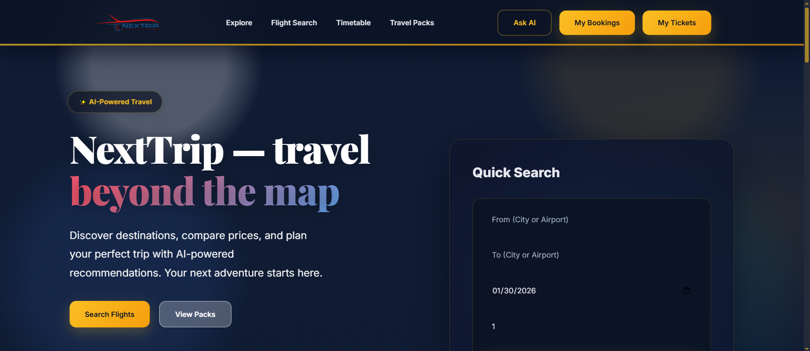
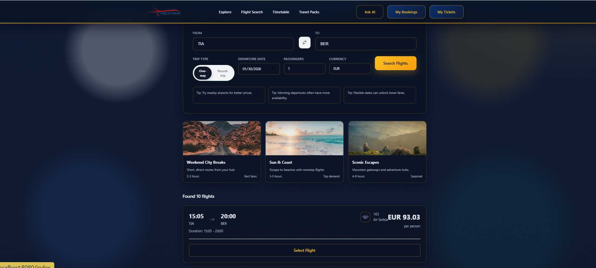
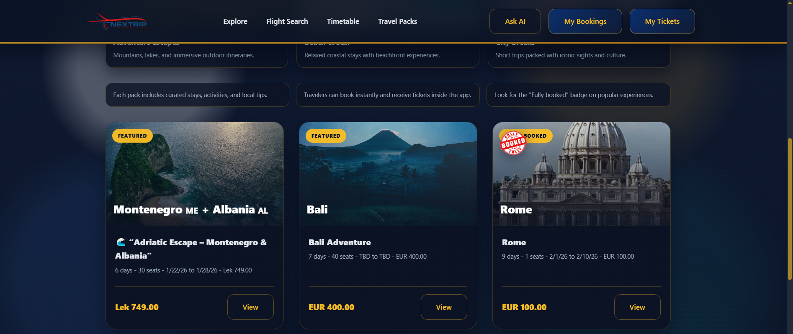
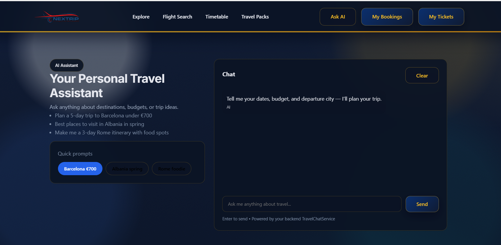
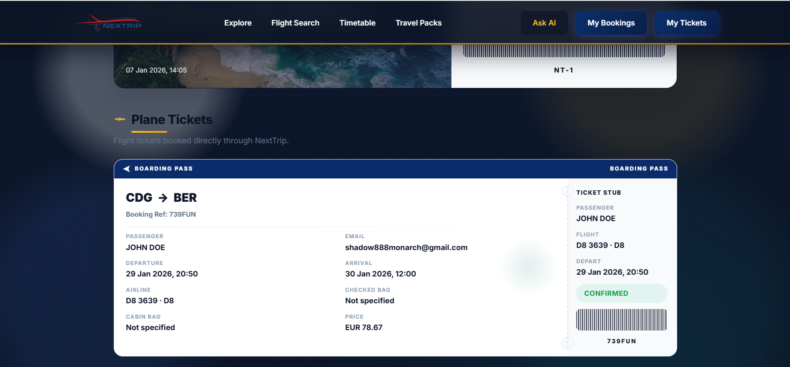
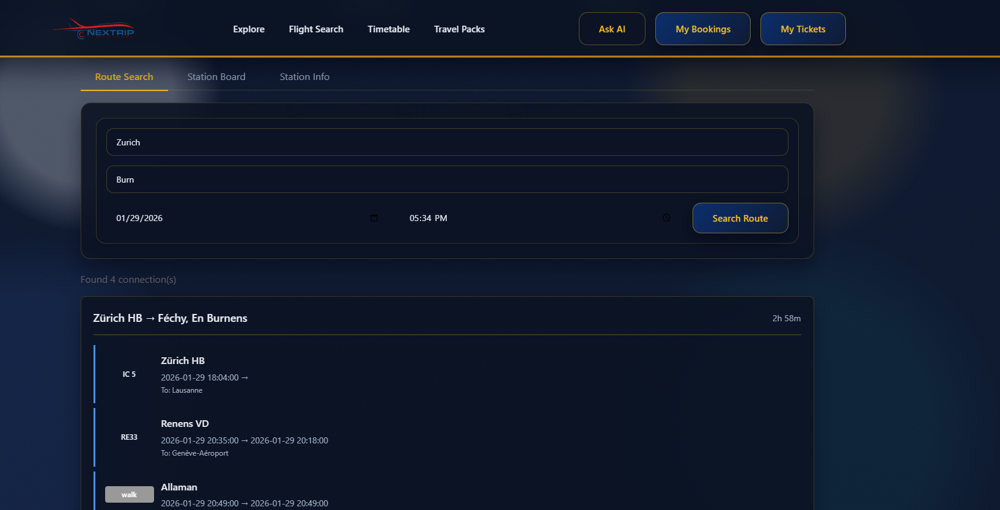

# NexTrip


NexTrip is a Spring Boot + Thymeleaf travel platform where users search flights, book curated travel packages, and pay securely with Stripe. It also includes an AI travel assistant, multi-role dashboards, Redis caching, Kafka events, and JPA-backed persistence.

## Features
- Flight search (Amadeus API) with caching and optional persistence
- Travel packages with booking and Stripe checkout
- AI assistant for travel suggestions (Hugging Face)
- Business and admin portals with role-based access
- Spring Security for authentication and protected routes
- JWT utilities for token-based auth flows
- Email notifications (Spring Mailer) for verification and updates
- WebSocket support for live interactions
- Redis cache for fast flight offer lookup
- Kafka event publishing for booking events (optional)

## Tech Stack


## Screenshots
Home Page


Flight Search


Travel Packages


AI Chat Assistant


My Tickets


Train Timetable


## CI & Tests
CI runs on GitHub Actions with a MySQL service and the `ci` Spring profile. Tests are executed with Maven and JaCoCo coverage is generated.

Run tests locally:
```bash
mvn -B clean test
```

Optional: run tests one by one (helpful for debugging):
```powershell
.\run-tests.ps1 -SkipIntegration -ContinueOnFailure
```
